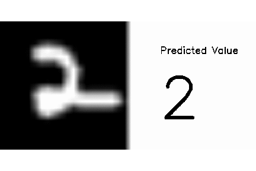

# Make_a_neural_network
This is the code for the "Make a Neural Network" - A challenge intriduce in Intro to Deep Learning #2 by Siraj Raval on Youtube

##Overview

This is the code for a challenge introduced on [this](https://youtu.be/p69khggr1Jo) video by Siraj Raval on Youtube. This is a [simple](http://computing.dcu.ie/~humphrys/Notes/Neural/single.neural.html) three-layer feedforward neural network (perceptron). We use grayscale 20 by 20 images of handwritten numbers as our inputs and expect the number shown in that image as our outputs. We'll use [backpropagation](http://neuralnetworksanddeeplearning.com/chap2.html) via gradient descent to train our network and make our prediction as accurate as possible.

##Dependencies

numpy

matplotlib

random

scipy.io to import .mat file of data

and some other libraries for visualisations

##Usage

Run the jupyter notebook ``Handwritten Numbers in python.ipynb`` with python 3.

## Result
20 random samples are shown here. Hand-written numbers are on the left side and the predictions are printed on the right side. You can get the same result by running [this jupyter notebook](https://github.com/yosoufe/Make_a_neural_network/blob/master/Handwritten%20Numbers%20in%20python.ipynb).

